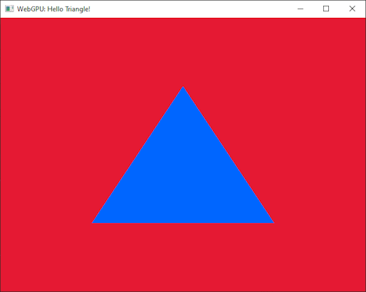

# Java-to-WebGPU

Java bindings for WebGPU, allowing you to develop native WebGPU applications from Java.




## Introduction

This is a library to use native WebGPU libraries using Java.

## How to

Before using any WebGPU functions call:
```java
    WebGPU_JNI webGPU = JavaWebGPU.init();
```
Then use the returned object to call the different WebGPU functions. For example:
```java
    Pointer instance = webGPU.wgpuCreateInstance(null);
    webGPU.wgpuInstanceRelease(instance);
```
Which is the equivalent of the following C++ code:
```C
    // We create the instance using this descriptor
    WGPUInstance instance = wgpuCreateInstance(nullptr);
    wgpuInstanceRelease(instance);
```
At some point you will need some auxiliary functions which are not provided by WebGPU itself. For this there is a utility library.
The native utility library can be accessed through `JavaWebGPU.getUtils()` as in the following example:
```java
    surface = JavaWebGPU.getUtils().glfwGetWGPUSurface(instance, windowHandle);
```
This utility library provides a method to get a WGPUSurface from a GLFW window and a method to read an image file.


## Modules
- `java-to-webgpu`  Java library to call WebGPU
- `demo` Sample application
- `jnrgen` Generator to create the Java bindings from a C++ header file
- `webgpuUtils`   Source of native utility library (C++)


## Coding caveats
The triangle demo follows the tutorial of WebGPU for C++ by Elie Michel (https://eliemichel.github.io/LearnWebGPU/), which is an excellent tutorial for creating native WebGPU applications (i.e. not in a browser).

Some difference will be apparent between the Java and C++ version:

### Resource handles
Any resource provided by WebGPU, such as an Adapter, a Device, a Texture, a Buffer, 
etcetera, is represented by a Pointer object.  Don't think of this as a pointer that you can dereference in any meaningful way. Just treat it as an identifier that you can pass to other functions.

In the C++ code there are different types defined for the different resources such as WGPUAdapter, WGPUDevice, etc. which helps keep the code more readable, but Java does not support the typedef mechanism for this.  

### Creating structures
Many WebGPU functions rely on a single descriptor parameter to pass the relevant options, instead of using lots of individual function parameters. 
So a regular pattern you will encounter is to create a descriptor object of some particular type, fill all its content and then pass it to the function you want to call.

In C++ it is very easy to create and fill a descriptor which is defined as a C struct:

```C
 	// Configure the surface
	WGPUSurfaceConfiguration config = {};
	config.nextInChain = nullptr;
	config.width = 640;
	config.height = 480;
	config.usage = WGPUTextureUsage_RenderAttachment;
	// etc.

	wgpuSurfaceConfigure(surface, &config);
```
 
In Java, we have to do a bit more work in order to put the data in native memory with the proper layout so that the object can be passed to the driver:

```java  
        WGPUSurfaceConfiguration config = WGPUSurfaceConfiguration.createDirect();
        config.setNextInChain();
        config.setWidth(640);
        config.setHeight(480);
        config.setUsage(WGPUTextureUsage.RenderAttachment);
        // etc.	
        webGPU.wgpuSurfaceConfigure(surface, config);
```

The `createDirect()` method is used to create an object in native memory. Access to its members is exclusively via getters and setters.


## Gradle commands
To run the triangle demo: 

    ./gradlew run

To compile the utility library (requires a C compiler to be installed, e.g. MSVC).: 

    ./gradlew :webgpuUtils:build  

To regenerate the bindings (empty the directory `jnrgen\src\generated` first): 

    ./gradlew :jnrgen:run

## Generating the bindings

The Java bindings were generated automatically from a C++ header file.  This header file is a slightly simplified version of `webgpu.h`, e.g. with some preprocessor commands removed.  The official C++ header file for WebGPU is maintained at [https://github.com/webgpu-native/webgpu-headers](https://github.com/webgpu-native/webgpu-headers).

Running the `jnrgen` application regenerates those files into `java-to-webgpu\src\main\java\com\monstrous\webgpu`. 
(The directory needs to be empty first, otherwise you will get an error message).  

The generator is based on work from Noah Charlton (https://github.com/kgpu/wgpu-java) but was heavily modified.

Future work: fix the generator to accept the original `webgpu.h` header file, so that any official updates can be reflected with minimal effort.

Currently, the bindings consists of the following:

     59 Enums
     169 Structs
     267 Functions
     23 Callbacks

## Under the hood
This library makes use of [JNR-FFI](https://github.com/jnr/jnr-ffi) to call native functions and uses Google's WebGPU implementation ([DAWN](https://dawn.googlesource.com/dawn)) as backend.

The demo makes use of [LWJGL3](https://github.com/LWJGL/lwjgl3) to create a window which in turn uses [GLFW](https://www.glfw.org/).


## How to use the library in your own projects

The library is available via jitpack.io. To include it in your project add the following lines
to your build.gradle file:

```groovy
    repositories {
        mavenCentral()
        maven { url 'https://jitpack.io' }
    }
    
    dependencies {
        implementation 'com.github.MonstrousSoftware:Java-to-WebGPU:-SNAPSHOT'
    }
```

[](https://jitpack.io/#MonstrousSoftware/Java-to-WebGPU)
